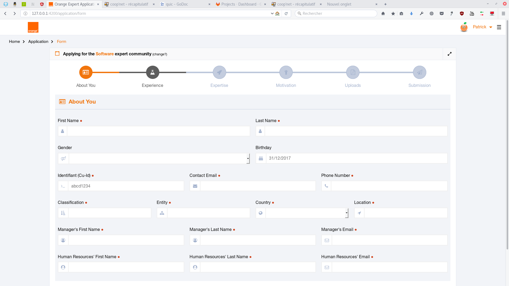
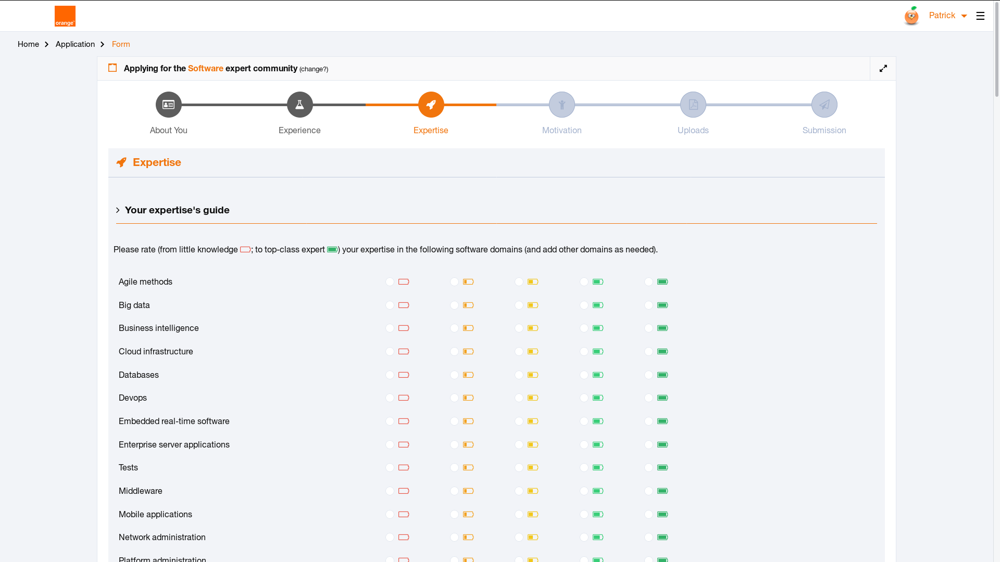

# OEMA (Orange Expert Management Application: front-end)

(cf misc/screenshots)

## Installation

This project was generated with [Angular CLI](https://github.com/angular/angular-cli) version 16.1.5.

Install Node.js:

* [View instructions](https://nodejs.org/en/download/package-manager/)
* [Fix npm permissions](https://docs.npmjs.com/getting-started/fixing-npm-permissions)

Git clone the repository. Then, run in the repository folder:

    export NG_CLI_ANALYTICS=off
    npm install

## Development server

Run `npx ng serve --proxy-config proxy.conf.json` for a dev server, or with https:
`ng serve --ssl --ssl-key "src/webserver/certificates/server.key" --ssl-cert "src/webserver/certificates/server.crt" --proxy-config proxy.conf.json`
Navigate to `https://localhost:4200/`. The app will automatically reload if you
change any of the source files.

## Code scaffolding

Run `ng generate component component-name` to generate a new component. You can also use `ng generate directive|pipe|service|class|guard|interface|enum|module`.

## Build for production server

You will find in the `src/webserver` folder a `front-server.js` implemented with
Express. Run the following command to build the project:

    ng build --aot --configuration production --output-path src/webserver/public

After building Angular, go to the `src/webserver` folder, install the Express
server with `npm install`, then run `NODE_ENV=production node front-server.js`.

## Running unit tests

Run `ng test` to execute the unit tests via [Karma](https://karma-runner.github.io).

## Running end-to-end tests

Run `ng e2e` to execute the end-to-end tests via a platform of your choice. To use this command, you need to first add a package that implements end-to-end testing capabilities.

## Further help

To get more help on the Angular CLI use `ng help` or go check out the [Angular CLI Overview and Command Reference](https://angular.io/cli) page.

## HTTP Routes

Try:
<https://127.0.0.1:4200>

<https://127.0.0.1:4200/application>

<https://127.0.0.1:4200/application/before>

<https://127.0.0.1:4200/application/form>

<https://127.0.0.1:4200/dashboard>

## Live deployment in prod

[https://orange-expert-recruitment.apps.fr01.paas.diod.orange.com/orange-experts/](https://orange-expert-recruitment.apps.fr01.paas.diod.orange.com/orange-experts/)

## Contact

* <patrick.truong@orange.com>
